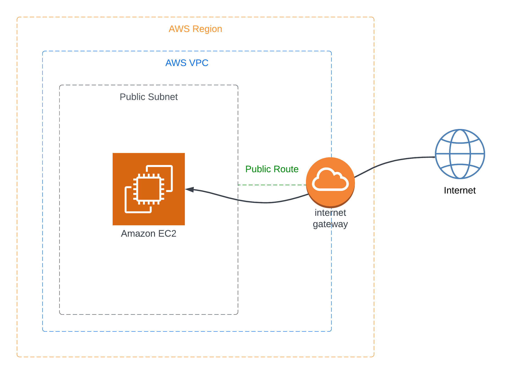

```
█▀▄▀█ ▄▀█ █▀ ▀█▀ █▄▀ █▀█
█░▀░█ █▀█ ▄█ ░█░ █░█ █▄█
```
---
MasTKO is a security tool which detects DNS entries associated with AWS’s EC2 servers susceptible to takeover attack and attempts a takeover. This tool aims to help development teams detect DNS hygiene issues and proactively fix them.

## The Vulnerability

Any AWS customer may request an EC2 instance with a public IP sourced from a pool of AWS EC2 IPs that is shared within the various availability zones in a AWS region. If the EC2 IP changes but the DNS mapping to the old IP remains, then the old IP goes back into the shared AWS IP pool and becomes available for anyone else to pick up. Domains mapped to such IPs can then be a target for MasTKO to attempt take over.

## How Does it Work

MasTKO is a CLI with two subcommands, `validate_targets` and `bruteforce`.

```
$ mastko --help
usage: mastko [-h] [--version] {bruteforce,validate_targets} ...

optional arguments:
  -h, --help            show this help message and exit
  --version             print out cli version

subcommands:
  Please select a subcommand. For more information run `mastko {sub-command} --help`.

  {bruteforce,validate_targets}
                        sub-commands:
    bruteforce          runs subdomain takeover bruteforce service
    validate_targets    validates and loads targets to DB
```

### validate_targets

This subcommand takes an input DNS hosts as a newline separate file and performs the initial recon to collect contextual details for the provided host and checks if the domains are vulnerable to EC2 subdomain takeover. The output is given two ways, as CSV file to users and also loaded to internal DB to facilitate Bruteforcing.

```
$ mastko validate_targets --help
usage: mastko validate_targets [-h] --hosts-file hosts_file [--region region]

options:
  -h, --help            show this help message and exit
  --hosts-file hosts_file
                        A newline delimited file with all interested domains.
  --region region       Filter target for a given AWS Region.
```

### bruteforce

#### prequisites:

* In order to run this command, a dedicated AWS Elastic IP and AWS EC2 instance is required. Refer to [AWS Setup](#aws-setup) section for more details.
* Requires AWS CLI credentials, please refer to: [Configuration and credential file settings](https://docs.aws.amazon.com/cli/latest/userguide/cli-configure-files.html) for more details. If you are running MasTKO inside the EC2 Instance created by our cloudformation ([AWS Setup](#aws-setup)), the AWS boto3 SDK will automatically fetch credentials from the attached instance role, no need to set user credentials.
* This subcommand should be run after running `validate_targets` as it is a pre-requisite.

#### bruteforcing

```
$ mastko bruteforce --help 
usage: mastko bruteforce [-h] --iterations iterations --elastic-ip eip_ip --ec2-instance-id instance_id --region region

optional arguments:
  -h, --help            show this help message and exit
  --iterations iterations
                        Specify the number of bruteforce iterations
  --elastic-ip eip_ip   Specify the Elastic IP to use for bruteforcing
  --ec2-instance-id instance_id
                        Specify the EC2 instance-id to use for bruteforcing
  --region region       Specify the AWS region to use for bruteforcing
```

The bruteforce service performs the following tasks:

1. Associating and immediately disassociating an Elastic IP to EC2 instance changes the public IP assigned to this instance. This rotation is done for specified number of `iterations`
2. Checking if a vulnerable IP is acquired

As a result, if a vulnerable IP has been acquired through brute forcing, we end up with complete control over the identified DNS record.

## Deployment

MasTKO is very versatile when it comes to deployment, at the bare minimum, this tool will require a Elastic IP and EC2 instance to get it up and running. Refer [AWS Setup](#aws-setup) section for more details.

There are a variety of deployment patterns for MasTKO. [Common Deployment Patterns](/docs/deployment_patterns.md) document covers a few patterns.

### AWS Setup



1. MasTKO requires EC2 deployed in public subnet of an AWS VPC. Use the AWS Cloudformation [vpc.yaml](aws/vpc.yaml) to deploy a bare minimum AWS VPC to run MasTKO. This cloudformation outputs the VPC ID and Subnet ID after creation, which will be required for next step. This step is optional if a VPC is already available.
2. For the bruteforcing function to work, masTKO requires a AWS EC2 host and a Elastic IP. Use the AWS Cloudformation [ec2_setup.yaml](aws/ec2_setup.yaml). This cloudformation template will output the EC2 Instance Id and the Elastic IP, these values are required for running the `mastko bruteforce` command. The AWS EC2 Instance deployed using the provided Cloudformation template has IAM permissions attached to run the bruteforce function and also AWS SSM permissions to connect to that instance using Session Manager.
   
#### AWS References:
1. To deploy a stack using AWS Cloudformation, follow step 3 in [Getting Started with AWS Cloudformation](https://docs.aws.amazon.com/AWSCloudFormation/latest/UserGuide/GettingStarted.Walkthrough.html)
2. [AWS VPC Documentation](https://docs.aws.amazon.com/vpc/latest/userguide/what-is-amazon-vpc.html)
3. [Connect to EC2 using Session Manager](https://docs.aws.amazon.com/AWSEC2/latest/UserGuide/session-manager.html)

## AWS Policy on Penetration Testing

AWS provides a guideline on the kind of security testing that is allowed on its platform. Although not explicitly stated, running tools like MasTKO should be done with utmost care. Please refer to [AWS Penetration Testing Policies](https://aws.amazon.com/security/penetration-testing/) for more details.

## Installation

MasTKO requires python >= v3.9 and it has been tested to work on v3.9.10

### Options 1:

```
python3 -m pip install --upgrade "mastko[all] @ git+ssh://git@github.com/intuit/mastko.git"
```
or

```
python3 -m pip install --upgrade "mastko[all] @ git+https://github.com/intuit/mastko.git"
```
then

```
mastko --help
```

### Option 2:

```
git clone git@github.com:intuit/mastko.git
cd mastko
python3 -m pip install .
mastko --help
```

## Contributing

Follow the contribution guidelines documented in [CONTRIBUTING.md](/CONTRIBUTING.md)

## LICENSE

This project is licensed under the terms of the [Apache 2.0 license](/LICENSE.md).

## External Dependencies

MasTKO requires that the following open source software to be installed to function:

1. [masscan](https://github.com/robertdavidgraham/masscan) licensed under [GNU Affero General Public License version 3](https://github.com/robertdavidgraham/masscan/blob/master/LICENSE)
2. [nmap](https://nmap.org/) licensed under [Nmap Public Source License (based on GNU GPLv2)](https://nmap.org/npsl/)

## Contributors

- [@anujbhan](https://github.com/anujbhan)
- [@diophant0x](https://github.com/diophant0x)
- [@Steeeeeeven](https://github.com/Steeeeeeven)
