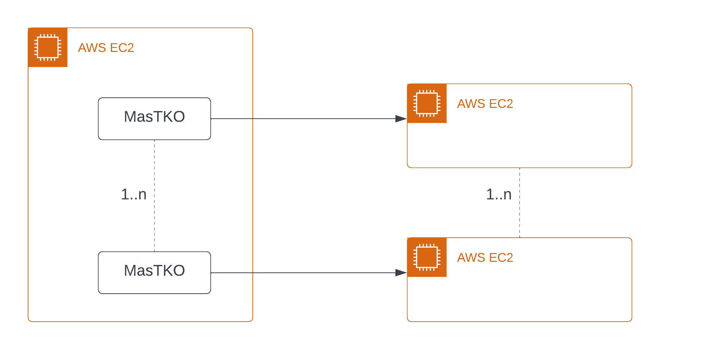
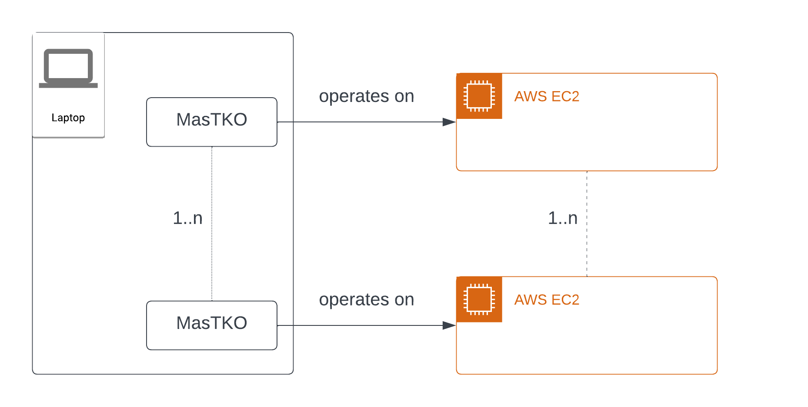
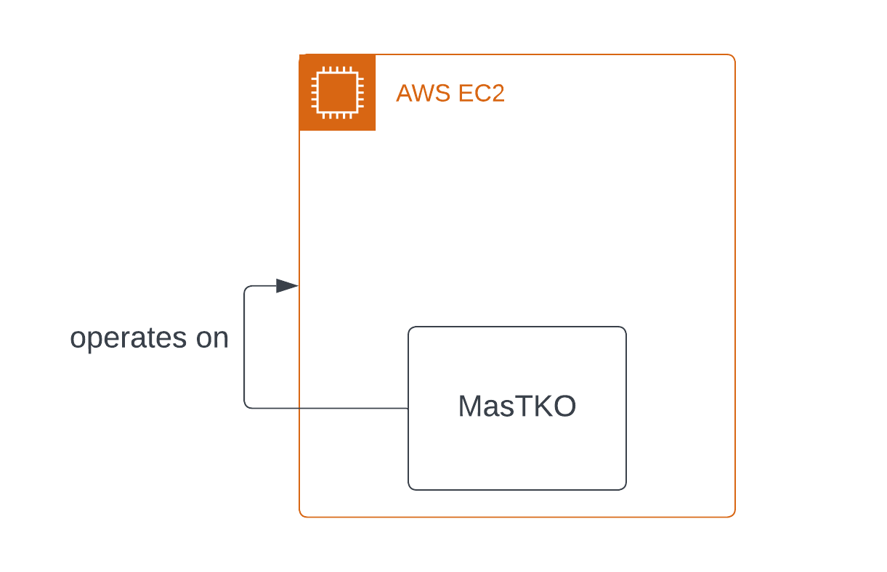

# Deployment Patterns for MasTKO

Although there are numerous ways in which MasTKO can be deployed, we have only presented a few below. All the patterns mentioned below require the AWS EC2 instances used by the brute force function to be deployed in a public subnet of AWS VPC with auto-assigned public IPs. Refer to [AWS Setup](/README.md#aws-setup) for more details.

## Pattern 1 (Recommended):

Run 1..n instances of MasTKO inside a AWS EC2 instance, each instance of MasTKO will require a unique AWS EC2 Instance Id and a unique AWS Elastic IP. This pattern is beneficial to run parallel instances of MasTKO to achieve greater probability of takeovers but will also increase cost. An additional benefit, versus [pattern 2](#pattern-2), is it removes dependency on a local machine, and theoretically will be faster because of reduced network path.

## Pattern 2:

Run 1..n instances of MasTKO inside your local machine, each instance of MasTKO will require a unique AWS EC2 Instance Id and a unique AWS Elastic IP. This pattern is beneficial to run parallel instances of MasTKO to achieve greater probability of takeovers but will also increase cost.

## Pattern 3:

Run MasTKO inside a AWS EC2 instance and let it bruteforce against itself. The tool will stop once it encounters a targeted (DNS, IP) pair or it reaches the max number of iterations. Disclaimer, during our testing, this deployment pattern has proven to the slowest, due to intermittent errors from AWS EC2 api calls resulting in errors.
